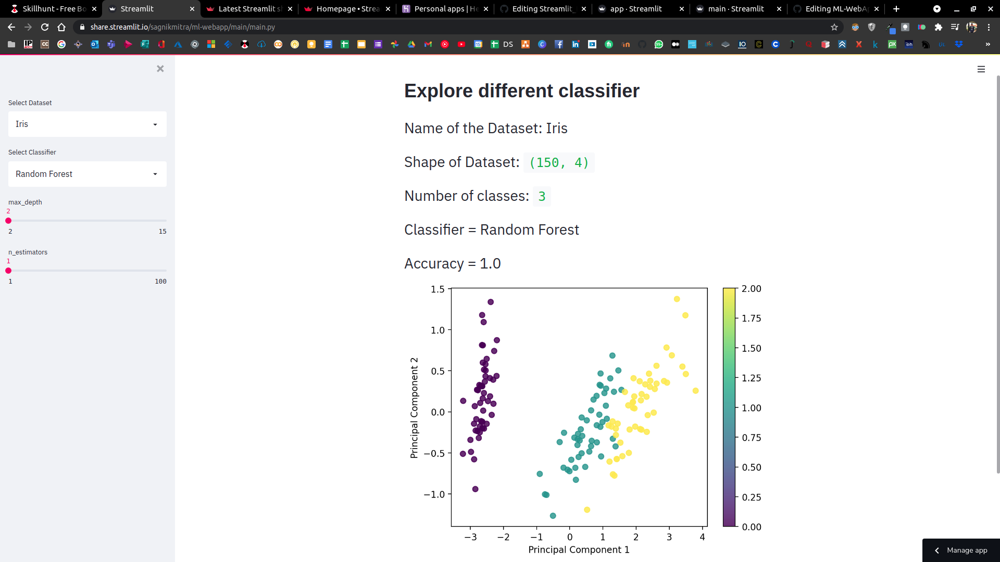

### Machine Learning Classifier Visualizer Web App

+ Random Forest, Support Vector Machine, K-Nearest Neighbours Classifier Visualizer App built with Streamlit
+ Datasets Used: Iris Dataset, Wine Dataset, Breast Cancer Dataset

#### Description
+ This is a sample Web App to visualize different General Classifiers

#### Purpose
+ Checking instant accuracy by changing hyperparameters using Streamlit Framework

##### To Install Streamlit
```bash
pip install streamlit
```
#### Running the App
+ cd into app
+ run the following

```bash
streamlit run main.py
```
#### Deploying to Heroku
##### Installing Heroku CLI
```bash
sudo snap install --classic heroku
```
##### Logging in with Heroku CLI
```bash
heroku login
```
##### Creating the Heroku APP (Must have a globally unique name)
```bash
heroku create yourname-ml-webapp
```

#### Pushing to Heroku Remote

```bash
git add .
git commit -m "heroku deployment"
git push heroku HEAD:master
```

#### Random Forest Classifier


#### Support Vector Machine


#### K Nearest Neighbours


#### By
+ Sagnik Mitra

#### Special Thanks to Marisa from the Streamlit Team
+ Awesome Tool & Super Handy
